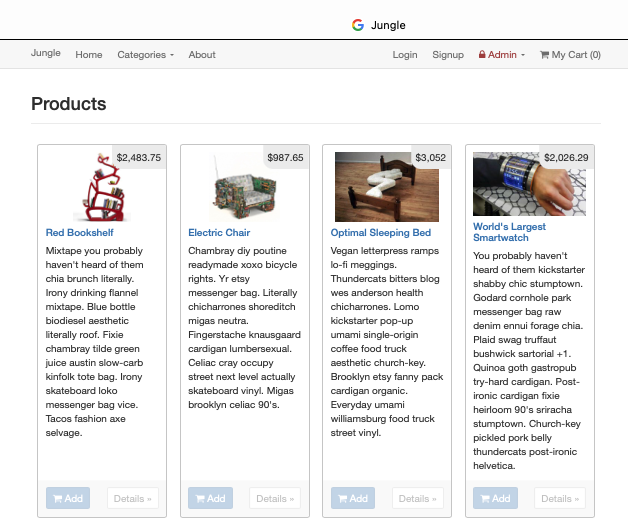
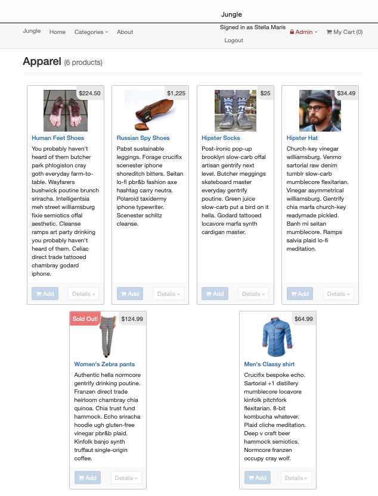
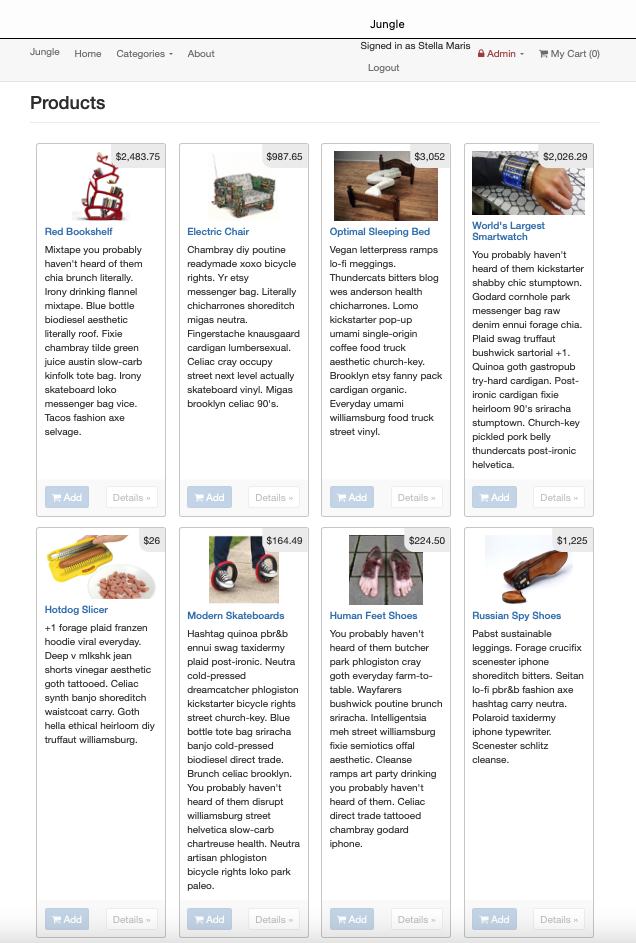
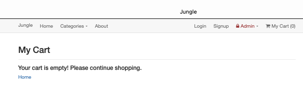
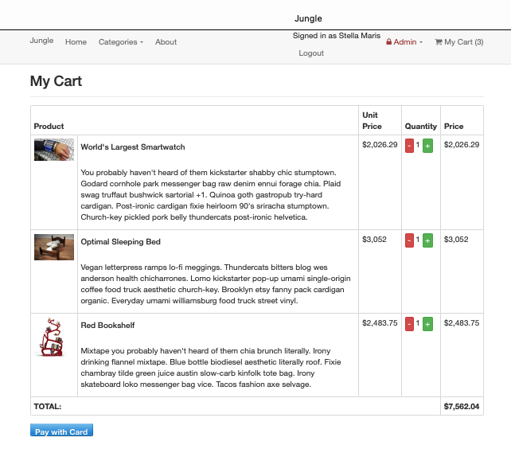
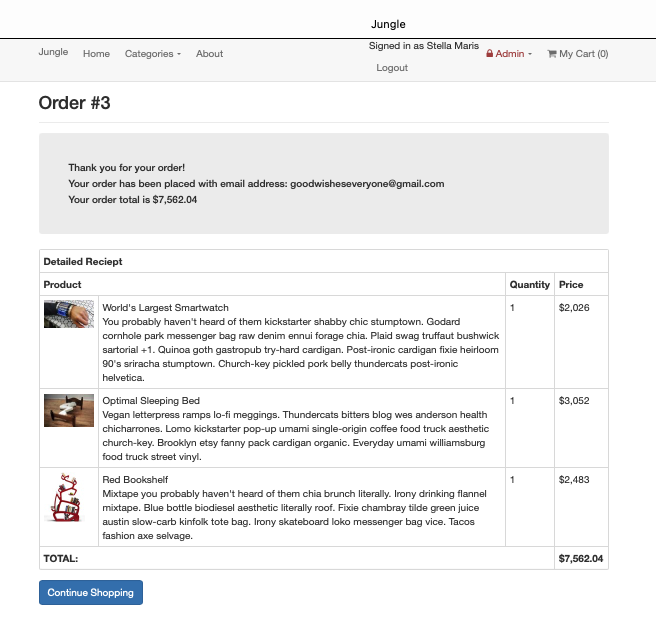
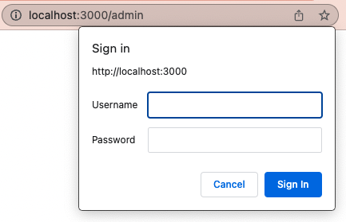
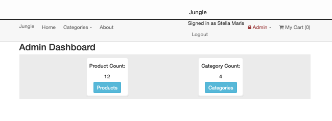
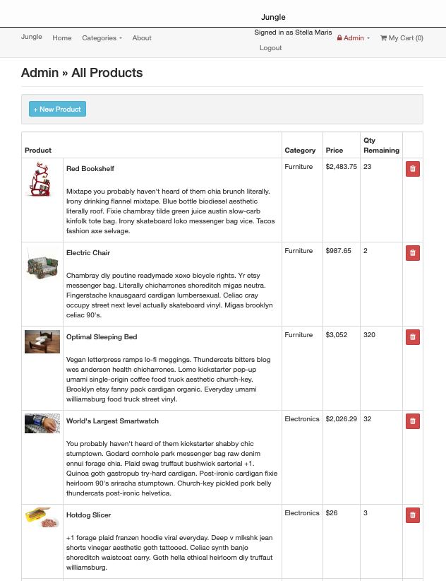
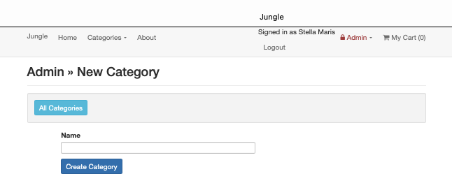

# **Jungle**
 
A mini e-commerce application built with Ruby and the Rails 4.2 framework. 

Jungle was built with users in mind from the main catalog to each products detail page.
Some special features of Jungle is authentication processes:
  1. Users do not need to sign in to view the products catalog and respective detail pages, however, a user must sign in to submit a review or delete a review 
  2. Admin users have an extra step of authentication to access the create product and create category pages

## Final Product
 
#### Home page showing product listing
 

#### User Page

*All Product Listing After User Login*

*Empty Cart Message*

 
*Shopping Cart with Items*

 
*Order Confirmation Page, after payment*

 
#### Admin Page

*Admin Only Login*

 
*Admin Only Category Dashboard*

 
*Admin Only All Products*

 
*Admin Only Categories*

 
 
## Additional Steps for Apple M1 Machines

1. Make sure that you are runnning Ruby 2.6.6 (`ruby -v`)
1. Install ImageMagick `brew install imagemagick imagemagick@6 --build-from-source`
2. Remove Gemfile.lock
3. Replace Gemfile with version provided [here](https://gist.githubusercontent.com/FrancisBourgouin/831795ae12c4704687a0c2496d91a727/raw/ce8e2104f725f43e56650d404169c7b11c33a5c5/Gemfile)

## Setup
 
1. Run `bundle install` to install dependencies
2. Create `config/database.yml` by copying `config/database.example.yml`
3. Create `config/secrets.yml` by copying `config/secrets.example.yml`
4. Run `bin/rake db:reset` to create, load and seed db
5. Create .env file based on .env.example
6. Sign up for a Stripe account
7. Put Stripe (test) keys into appropriate .env vars
8. Run `bin/rails s -b 0.0.0.0` to start the server
 
## Stripe Testing
 
Use Credit Card # 4111 1111 1111 1111 for testing success scenarios.
 
More information in their docs: <https://stripe.com/docs/testing#cards>
 
## Dependencies
 
* Rails 4.2 [Rails Guide](http://guides.rubyonrails.org/v4.2/)
* PostgreSQL 9.x
* Stripe
 
#### Have fun shopping!